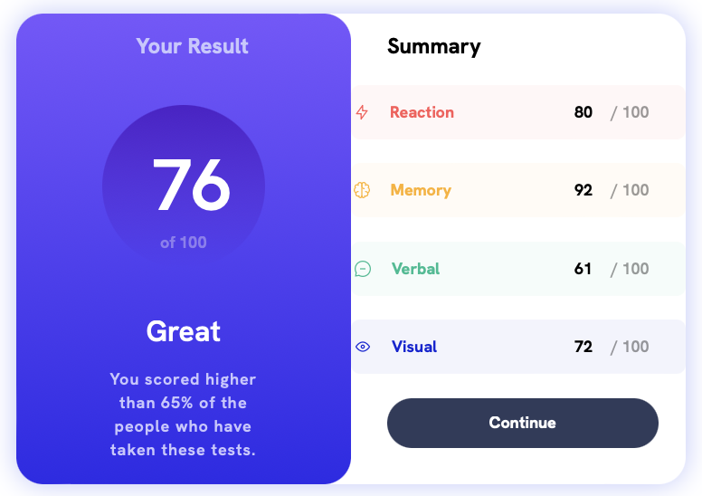

# Zhiqing Pan's website
> Welcome to my personal website! 
## About me
- 

- I am an undergraduate student in [Shan Dong University of Science and Technology](https://en.sdust.edu.cn) at the [College of Geodesy and Geomatics](https://gc.sdust.edu.cn/). I am currently working on the topic of **Geographic Information Systems (GIS)** and **Medical Image Auto Analysis Systems**. High-performance 3D terrain rendering is my next topic to dive into.

## Skills

### 1. programming language
|language| repository | description |
|:---:|:---:|:---:|
|JavaScript| [RVGeo](https://github.com/pzq123456/RVGeo/tree/main/rvgeo) | A JavaScript library for spacial information analysis and visualization. |
|Python| [MapCommunity](https://github.com/pzq123456/mapcommunity) | A Flask web application for map community. |
|Java| [JavaHelloWorld](https://github.com/pzq123456/JAVAhelloWorld) | Simple Java homework |

### 2. Frontend demo

|name|screenshot|url|
| :--: | :--: | :--: |
| results-summary-component |  | https://pzq123456.github.io/results-summary-component/ |
| Interactive-rating-component |  | https://pzq123456.github.io/Interactive-rating-component/ |

> Thanks for Frontend Mentor's challenge!

### 3. Data analysis and Intelligent algorithm
| repository | description |
|:---:|:---:|
| [MedicalAI](https://github.com/pzq123456/MdicalAI) | medical image auto segmentation model |
| [MIP](https://github.com/pzq123456/MIP) | Medical Image analysis and processing platform based on Web (we will opensource it soon!) |

## Contact me
- Email: 1812673119@qq.com

> This website will be updated regularly. If you have any questions, please contact me by email. Thank you for your support!
> Next version will be constructed by Vue3.js, and will have more functions. Stay tuned!

